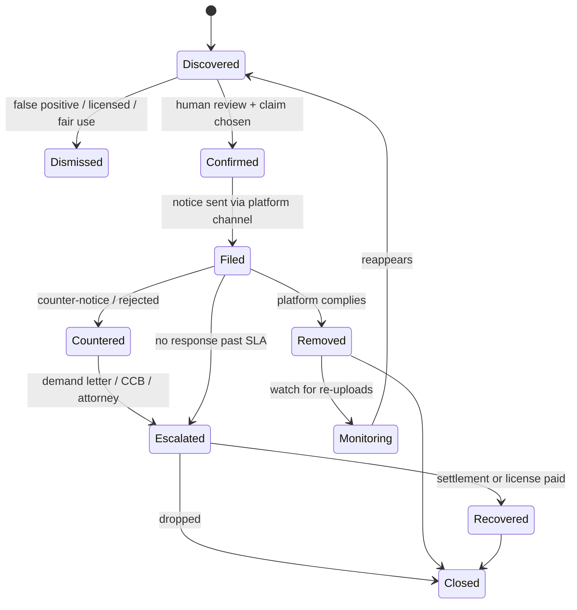
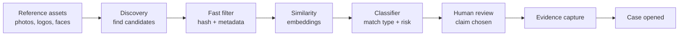

# VisionGuard — Product Outline

Sep 22, 2026 · Steven

## Executive summary

VisionGuard finds where your images, face and brand assets are being used without permission, proves it, and gets them removed or paid for. It's one engine sold in two modes: **People** (creators, models, talent, anyone being impersonated) and **Brands** (logos, product photos, packaging, designs).

The core bet: detection is a commodity, but removal and recovery aren't. Customers don't pay to learn that their content is stolen. They pay when it disappears, when the fake account gets banned, or when a licensing fee comes back. So VisionGuard is an enforcement product with detection underneath it, not a search engine with a takedown button.

**The product in one line per layer:**

- **Protect:** register the assets and identities you own (photos, face, logos, product shots), with proof of ownership or consent.
- **Discover:** continuously search the open web, social platforms and marketplaces for copies, near-copies, impersonators and counterfeits.
- **Verify:** score each match, then have a human confirm it and pick the right legal claim (copyright, trademark, likeness, intimate-image law).
- **Prove:** capture timestamped, hash-sealed evidence for every infringement.
- **Enforce:** file takedowns through each platform's official channel, track the results, escalate, and pursue licensing fees where there's money in it.
- **Report:** a dashboard showing what was found, removed and recovered, which is the proof customers renew on.

**Wedge (decided): agencies first.** talent agencies, model agencies and creator management firms. The agency pays, holds contracts giving consent to search its people's faces, and needs likeness and image protection at the same time. That sidesteps the biggest risk of consumer face search (strangers searching other people). Brands come second, starting with direct-to-consumer (DTC) sellers fighting stolen product photos and counterfeit listings.

## The problem and who has it

The pain is sharpest, and willingness to pay is proven, where stolen content costs someone money or safety every day it stays up. Creators losing subscription revenue to leaks already pay $49–$1,200/month for removal ([Fanlock comparison](https://fanlock.com/best-content-protection-for-creators)). Brands facing counterfeits pay Red Points $15K+/year ([Knockoff review](https://knockoff.co/guides/red-points-review)). Casual individuals rarely pay at all.

| Segment | What gets stolen | Why it hurts | Urgency | Willingness to pay |
| --- | --- | --- | --- | --- |
| Subscription creators (OnlyFans, Fansly, Patreon) | Paid photos and videos leaked to tube sites, Telegram, Reddit | Direct revenue loss; leaks rank above their own pages in search | Very high, ongoing | Proven: $49–$1,200/mo |
| Models and talent (via agencies) | Portfolio and campaign images; face used in fake ads, deepfakes, scam accounts | Unpaid commercial use of likeness; reputation damage; lost booking fees | High | Agencies pay on the talent's behalf; WME and CAA partner with Loti |
| Influencers and public figures | Face and name used for impersonation accounts, crypto/scam ads, AI deepfakes | Fans get scammed; brand deals hurt | High, spikes | Medium–high |
| Photographers and illustrators | Images reused on blogs, stores, ads | Lost licensing fees | Low (chronic) | Low subscription; high on contingency (Pixsy model) |
| DTC brands ($1M–$20M revenue) | Product photos, logos, listings cloned on Amazon, Temu, Shein, TikTok Shop and Shopify dropship stores | Lost sales, price undercutting, bad reviews of fakes hurt the real brand | High during launches | $500–$1,500/mo; priced out of Red Points |
| Enterprise brands | Counterfeits, trademark abuse, phishing sites, executive impersonation | Revenue, fraud, safety | Continuous | High ($15K–$250K+/yr), but served by incumbents |
| Ordinary individuals | Personal photos reposted, fake dating/social profiles, non-consensual intimate images | Harassment, sextortion, reputation | Acute when it happens | Low except in a crisis |

**The underlying problem is the same everywhere:**

1. **Finding it is hard.** Content spreads across thousands of sites, many behind logins, in private channels, or cropped, filtered and mirrored to beat simple matching.
2. **Removing it is tedious.** Every platform has its own form, evidence rules and response time. Repeat uploads mean doing it again.
3. **Knowing your rights is confusing.** Is it copyright, trademark, likeness, or an intimate-image claim? The wrong claim gets rejected, and a false claim creates legal exposure.
4. **Proving it is manual.** Screenshots get disputed, and pages change or vanish.

**Tailwinds:**

- **AI makes theft cheaper.** Deepfakes, AI-generated product photos and cloned stores cost almost nothing to produce, so volume keeps rising.
- **Counterfeiting is huge.** Global trade in fake goods reached USD 467 billion ([OECD/EUIPO, May 2025](https://www.oecd.org/en/about/news/press-releases/2025/05/global-trade-in-fake-goods-reached-USD-467-billion-posing-risks-to-consumer-safety-and-compromising-intellectual-property.html)).
- **New law helps enforcement.** New US and EU rules force platforms to respond faster (see Legal foundation).

## Market and competitive landscape

The market is crowded but split into silos, and that's the opening. Creator tools do leaks, Loti does celebrity likeness, Pixsy does photographer licensing, and Red Points does enterprise counterfeits. Nobody serves an agency or a mid-size brand across images, likeness and trademarks in one place at mid-market prices.

| Company | Focus | Customer | Price / model | Signal |
| --- | --- | --- | --- | --- |
| [Loti](https://pulse2.com/loti-ai-16-2-million-series-a-raised-for-likeness-protection-technology/) | Likeness: deepfakes, impersonation, leaks (face + voice) | Celebrities via WME and CAA; now consumers | Free + paid tiers | $16.2M Series A (Apr 2025, Khosla); claims 95% takedown success in under 17 hrs ([Ensemble](https://www.ensemble.vc/research/loti-ai-expands-beyond-celebrities-launches-free-likeness-protection-for-all)) |
| [Doppel](https://www.prnewswire.com/news-releases/doppel-raises-70m-series-c-to-meet-rising-demand-for-ai-driven-social-engineering-defense-302619463.html) | Brand and executive impersonation, phishing, social engineering | Enterprise security teams (200+ customers) | Enterprise contracts | $70M Series C at $600M+ valuation (Nov 2025) |
| [Red Points](https://knockoff.co/guides/red-points-review) | Counterfeits, marketplace listings, fake sites | Multi-trademark brands | From $938/mo, \~$15K/yr minimum, metered per trademark and marketplace | Complaints: false positives, hard to cancel |
| [Knockoff](https://knockoff.co/guides/red-points-review) | Photo-based IP protection for small brands | Shopify stores | $799/mo, no contract | Proves small brands will pay monthly |
| [BrandShield](https://www.brandshield.com/blog/brandshield-vs-red-points/), Corsearch, MarkMonitor | Trademark watch, counterfeits, domains | Enterprise and law firms | Enterprise contracts | Entrenched incumbents |
| [Pixsy](https://picdefense.io/demand-letters/enforcement/pixsy/) | Image theft + licensing recovery | Photographers (80K+ members) | Takes 50% of recoveries; demands typically $500–$800/image | 100K+ cases handled; shows contingency works |
| Creator tools: Rulta, Ceartas, BranditScan, Fanlock, LeakRemover, Onsist, TakedownsAI | Leak detection and DMCA for adult and subscription creators | Individual creators, OF management agencies | $49–$1,200/mo ([Fanlock](https://fanlock.com/best-content-protection-for-creators)) | Crowded and price-competitive; success rates are self-reported |
| [PimEyes](https://en.wikipedia.org/wiki/PimEyes) | Open face search + paid alerts and takedown help | Anyone | Freemium subscriptions | BIPA lawsuit (2023), EU/UK regulator complaints, used for doxing. The model to avoid |

**Where VisionGuard can win:**

- **Agencies as the buyer.** One contract covers a whole roster of talent. Loti owns the top Hollywood agencies. The thousands of mid-tier model, influencer and creator management agencies are underserved.
- **Mid-market brands.** There's a gap between Knockoff ($799/mo, Shopify-only) and Red Points ($15K+/yr, metered). Aim for flat pricing with no per-trademark metering.
- **Evidence quality.** Court-ready, hash-sealed evidence packs set you apart from creator tools that just fire off DMCA notices.
- **Recovery, not just removal.** Most likeness and brand tools only remove content. Adding licensing and settlement recovery (the Pixsy model) for commercial misuse of a model's image or a brand's product photo creates a second revenue line.

**What I wouldn't compete on:** consumer face search (PimEyes and Loti own the attention and carry the legal risk), enterprise phishing and security (Doppel), and adult-creator leak removal as the primary market (a price war with 7+ players).

## Legal foundation

Every finding has to map to a specific legal claim, because the claim decides which channel you file through, what proof you need, and what happens if you're wrong. The product's claim engine is the heart of it. This is a research summary, not legal advice; an IP attorney needs to sign off on templates and claim logic before launch.

| Claim | What it protects | Enforcement channel | What you must prove | Strength for VisionGuard |
| --- | --- | --- | --- | --- |
| Copyright (DMCA §512) | Original photos, videos, illustrations, product photography, packaging art | DMCA notice to host or platform; Google search delisting; [Copyright Claims Board](https://ccb.gov/faq/) for money | Ownership (or exclusive license) and copying | Strongest, fastest. Core of the product |
| Trademark (Lanham Act) | Logos, brand names, distinctive trade dress | Platform trademark forms (Amazon Brand Registry, Meta IP form), not DMCA | Registered or common-law mark; use in commerce; likely confusion | Strong for counterfeits and lookalike listings; needs registration for most platform tools |
| Right of publicity / likeness | A person's name, face, voice used commercially without consent | Platform impersonation and privacy forms; demand letters; state law (e.g. NY, CA, TN's ELVIS Act) | Identity is recognizable; commercial use; no consent | Strong for fake ads and endorsements; varies by state |
| Intimate images, real or AI-made ([Take It Down Act](https://www.ftc.gov/business-guidance/resources/complying-take-it-down-act)) | Non-consensual intimate images, including AI "digital forgeries" | Platform's required TIDA removal process | Depicts the person; no consent | Very strong. Platforms must remove within 48 hrs |
| AI digital replicas ([NO FAKES Act](https://www.hklaw.com/en/insights/publications/2026/06/senate-judiciary-committee-advances-legislation-to-protect-name), pending) | Voice and visual likeness in AI-generated content | Would add a DMCA-style federal notice-and-takedown | Unauthorized replica | Future tailwind. Passed Senate Judiciary unanimously on June 18, 2026; not yet law |
| Impersonation / platform policy | Fake accounts posing as a person or brand | Platform impersonation reports | Identity documents; the account misleads | Not a legal claim, but often the fastest removal route |

**Key rules that shape the product:**

- **Take It Down Act is live.** Since May 19, 2026, covered platforms must remove reported intimate images, and known identical copies, within 48 hours. Violations can cost $53,088 each, enforced by the FTC ([FTC](https://www.ftc.gov/business-guidance/resources/complying-take-it-down-act)). This is the most powerful removal lever for the People mode.
- **Wrong claims are a liability.** Under DMCA §512(f), anyone who knowingly sends a false takedown can be sued for damages. After [Lenz v. Universal](https://en.wikipedia.org/wiki/Lenz_v._Universal_Music_Corp.), senders must consider fair use first. Sending a DMCA notice for a trademark issue is a known way to get sued ([KP Law](https://www.kplawyers.com/archive/use-of-dmca-takedown-notice-for-alleged-trademark-infringement-c/)). So every notice needs a human check and the right claim type.
- **Registration unlocks money.** US works generally need a registration before a federal suit, and timely registration is needed for statutory damages. The Copyright Claims Board only needs a filed application. Its cap is $30,000 per case and $15,000 per work, and respondents can opt out ([CCB](https://ccb.gov/faq/)). The product should prompt customers to register their most valuable work.
- **Fonts and colors are mostly weak claims.** In the US, typeface designs aren't copyrightable (only the font software is). A single color is protected only after it has acquired distinctiveness as a trademark, like Tiffany blue. Treat these as signals that raise a trademark or trade-dress case, never as standalone claims.
- **Biometric laws govern face search.** Illinois BIPA, Texas CUBI and Washington's biometric law require informed consent before capturing face geometry. Texas got $1.4B from Meta over face recognition in July 2024 ([Texas AG](https://www.texasattorneygeneral.gov/news/releases/attorney-general-ken-paxton-secures-14-billion-settlement-meta-over-its-unauthorized-capture)), and PimEyes faces a BIPA suit ([Wikipedia](https://en.wikipedia.org/wiki/PimEyes)). The product needs written biometric consent, a retention and deletion policy, and face templates only for verified, consenting people. The current plan to exclude Illinois and Washington at launch fits this.
- **EU trusted flagger status.** Under the Digital Services Act (Art. 22), a national coordinator can designate an entity as a trusted flagger, whose notices platforms must prioritize. It requires expertise, independence and accuracy reporting ([William Fry](https://www.williamfry.com/knowledge/trusted-flaggers-under-the-dsa-what-you-need-to-know/)). It's a later-stage moat for EU expansion.

## Product definition

VisionGuard is a case-management system for IP and likeness violations. Every finding becomes a **case** that moves from discovered to resolved, with evidence and a legal basis attached. People mode and Brands mode share that core and differ only in what gets protected and which claims apply.

### The two modes

|  | People mode | Brands mode |
| --- | --- | --- |
| Buyer | Talent/model agencies, creator management firms, later individual creators | DTC brands, e-commerce sellers, later agencies and law firms serving brands |
| Protected subject | A person: face, name, handles, portfolio and paid content | A brand: logos, marks, product photos, packaging, listings, domain |
| Main threats | Leaks, impersonation accounts, fake ads and endorsements, deepfakes, unlicensed commercial use of photos | Stolen product photos, counterfeit listings, logo misuse, cloned stores, lookalike ads |
| Main claims | Copyright, likeness, Take It Down Act, impersonation policy | Copyright, trademark, trade dress, impersonation policy |
| Where it's found | Social platforms, tube and leak sites, Telegram, search engines, ad libraries | Amazon, Temu, Shein, TikTok Shop, eBay, AliExpress, Etsy, Shopify stores, Meta ad library, search |
| What success looks like | Leak removed, fake account banned, licensing fee paid | Listing removed, seller banned, store taken down, settlement paid |

### Core objects

- **Workspace:** the paying customer (an agency or brand), with its team members, roles and white-label settings.
- **Subject:** a protected person or brand inside a workspace. An agency has one subject per model or creator.
- **Rights record:** proof of what the subject is allowed to enforce: copyright registrations or originals with metadata, trademark registrations, the agency's management contract, and signed biometric consent. Nothing gets enforced without one.
- **Asset:** a thing to watch for: a photo, video frame, logo, product shot or face template (only with consent), plus text identifiers like names, handles and brand terms.
- **Watch:** which sources to scan for a subject, and how often.
- **Match:** a candidate hit with a similarity score, match type (exact, cropped/edited, AI-altered, face-only, logo) and a source URL.
- **Case:** a confirmed violation, carrying its claim type, evidence pack, actions taken, platform responses and final outcome.
- **Evidence pack:** screenshot, full-page archive, page HTML, hashes, trusted timestamp, and the matched asset side by side.
- **Action:** one enforcement step, such as a DMCA notice, trademark report, impersonation report, TIDA request, demand letter or CCB filing.
- **Recovery:** money collected through licensing or settlement, and how it's split.

### Case lifecycle

Every removed case stays watched, because re-uploads are the norm. A reappearance reopens it with its history attached.

### Key user journeys

1. **Agency onboards a roster.** The agency imports its models or creators. Each person gets a consent link, where they verify identity with a selfie and ID check, sign biometric and enforcement consent, and connect their social handles. The agency uploads portfolios, or VisionGuard pulls them from the connected accounts.
2. **Brand onboards.** The brand connects its Shopify store or uploads its catalog. VisionGuard imports trademark registrations from the USPTO by owner name and registers logos and product photos as assets.
3. **Daily triage.** An inbox of new matches, grouped by subject and severity. The reviewer confirms or dismisses each one and the system suggests the claim. Bulk actions handle floods, like 200 listings from the same seller.
4. **One-click enforce.** Confirmed cases get filed through the right channel automatically. Where a platform needs a human to submit a form, the system queues it for staff.
5. **Escalate and recover.** Commercial misuse (a brand using a model's photo in an ad, a store selling with stolen product shots) goes to a recovery track: licensing demand, then CCB, then partner attorney.
6. **Report.** A monthly report per subject shows what was found, removed and recovered, plus time to removal. Agencies can forward it to talent as proof of value.

## How detection works

Detection is a funnel: pull in lots of cheap candidates, filter them hard with increasingly expensive checks, and put a human on the last step. The quality bar is **precision over recall**. A wrong takedown creates legal risk, but a missed match just gets caught next scan.

Each stage cuts the volume by roughly an order of magnitude, so the expensive steps (vision models, human time) only see a small fraction of what discovery pulls in.

### 1. Discovery: where candidates come from

| Source | What it finds | Notes |
| --- | --- | --- |
| Reverse image search APIs ([Google Lens via SerpApi](https://serpapi.com/google-lens-api), [TinEye](https://blog.tineye.com/new-image-search-pricing/)) | Exact and visually similar copies on the open web; Lens also returns product matches | Cheapest broad coverage. The Bing Search APIs, including visual search, were retired on Aug 11, 2025 ([Microsoft](https://learn.microsoft.com/en-us/lifecycle/announcements/bing-search-api-retirement)), so don't design around Bing |
| Keyword and handle search | Name, brand terms, handles, product names across search engines and platforms | Finds impersonators and listings that image search misses |
| Targeted platform crawlers | Marketplace listings, social profiles and posts, leak and tube sites, Shopify stores | Highest value and highest cost (anti-bot measures, proxies, terms of service). Start with the 5–10 sources the wedge customer cares about |
| Ad libraries | Paid ads using a face or product photo | Fake endorsement ads are a top likeness complaint |
| Customer and fan reports | Links submitted by talent, fans or staff | Cheap, high precision; build an intake form and browser extension early |
| Re-upload watch | Known violating URLs, sellers and accounts | Repeat offenders drive most volume |

### 2. Matching: deciding if it's really theirs

- **Fast filter:** perceptual hashes catch exact and lightly edited copies almost for free.
- **Similarity:** image embeddings catch crops, filters, mirroring, text overlays and composites. Logo detection finds a mark inside a larger image.
- **Face matching:** runs only for subjects with signed biometric consent, and only compares found faces against that subject's template. It never searches arbitrary faces. It flags AI-altered and deepfake content as its own match type.
- **Classifier:** combines the signals (similarity, source type, seller history, page text such as "replica" or "leaked", price far below retail) into a score and a suggested claim type.

### 3. Review: the human step

- A reviewer sees the found item beside the original, the score and the suggested claim, and confirms or dismisses it.
- The system checks the customer's allowlist (licensees, authorized resellers, affiliates) before anything reaches review. This is the top complaint about Red Points, so it deserves real care.
- Fair-use flags (commentary, news, parody) route to a slower lane with a stricter review.
- At first, VisionGuard staff do the review as a managed service. Later, customers can review their own cases and staff handle only escalations.

### 4. Evidence: proof that holds up

- Capture a screenshot, a full-page archive and the raw HTML at the moment of discovery. Hash every file and get a trusted timestamp (RFC 3161, already in the VisionGuard spec).
- Record the seller or account identity, price, listing ID and view or follower counts. These drive damages and priority.
- Keep a chain-of-custody log. Evidence packs export as a PDF for platforms, lawyers or the CCB.

## Enforcement

Enforcement is where customers feel the value, and it's mostly operations, not AI. Every platform has its own channel, evidence rules and speed. Knowing them, and keeping a clean filing record so platforms trust your notices, is the real moat.

### Platform channels

| Target | Best channel | Needs | Notes |
| --- | --- | --- | --- |
| Google Search | Copyright removal form; bulk via the [Trusted Copyright Removal Program](https://services.google.com/fh/files/misc/tcrp-faq.pdf) | Accurate history; clear-cut cases only | TCRP gives bulk upload, no CAPTCHA and a default 5,000 URLs/day. Delisting leak pages is huge for creators. Qualify by keeping accuracy high |
| Amazon | Brand Registry "Report a violation"; [Project Zero](https://www.velocitysellers.com/2026/04/28/amazon-brand-protection-stack-project-zero-transparency-ip-accelerator/) self-service removal | Registered trademark; clean reporting history | Project Zero is invite-only and depends on report accuracy. Brands without a mark can use IP Accelerator to get Brand Registry in \~4–6 months |
| Meta (Facebook, Instagram) | IP reporting forms; [Brand Rights Protection](https://searchengineland.com/meta-tools-brand-safety-controls-436835); impersonation reports | Trademark or copyright proof; ID for impersonation | Fake endorsement ads and impersonator accounts are the top likeness problem here |
| TikTok, YouTube, X, Reddit | Each platform's copyright, trademark, privacy and impersonation forms | Varies | YouTube has its own copyright tools; the rest are mostly web forms |
| Marketplaces (Temu, Shein, AliExpress, eBay, Etsy, TikTok Shop) | Each platform's IP portal (eBay VeRO, Alibaba IPP, etc.) | Registered rights are usually required | High volume, fast repeat offenders. Bulk filing matters |
| Independent sites and Shopify stores | DMCA notice to the site, its host, its CDN and the platform (e.g. Shopify) | WHOIS/host lookup | If the host ignores you, go upstream: CDN, registrar, payment processor |
| Telegram, Discord, leak forums | Platform abuse forms; DMCA to hosting providers | Links to specific messages or files | Hardest to remove. Search delisting often does more good |
| Any covered platform (intimate images) | [Take It Down Act](https://www.ftc.gov/business-guidance/resources/complying-take-it-down-act) request | Depicts the subject; no consent | 48-hour legal deadline. Confirm whether an authorized agent can file for the victim |

### Escalation ladder

1. **Platform notice:** the right claim through the right channel. Most cases end here.
2. **Follow-up:** re-file or appeal after the platform's normal response window. Track response time by platform.
3. **Upstream:** host, CDN, domain registrar, payment processor, app store.
4. **Demand letter:** for commercial misuse where there's someone to pay (a brand, store or advertiser). Ask for removal plus a retroactive license fee.
5. **Copyright Claims Board:** claims up to $30,000 per case; only needs a filed registration application ([CCB](https://ccb.gov/faq/)).
6. **Partner attorney:** federal suit on contingency, for registered works and high-value cases.

### Recovery: the second revenue line

Removal protects customers, but recovery pays them. When a business uses a model's photo in an ad, or a store sells with a brand's stolen product shots, there's a license fee to claim. Pixsy shows it works at scale: 100K+ cases with demands typically $500–$800 per image and a 50% split ([PicDefense](https://picdefense.io/demand-letters/enforcement/pixsy/)). Pixsy is also criticized as aggressive, so VisionGuard should keep its demands fair, documented and reviewed by a human.

### Filing hygiene (protects the moat)

- Keep the wrong-claim rate low. Platforms, Google's TCRP and Amazon's Project Zero all reward accuracy, and §512(f) punishes false claims.
- Check the allowlist first, re-verify before filing, and never file on a match a human hasn't confirmed.
- Track acceptance rate and time to removal by platform and claim type. This data improves filing strategy and becomes a selling point.

## Trust, safety and abuse prevention

A tool that finds faces and removes content can be turned into a weapon, and misuse is the fastest way to kill this company. Trust and safety is part of the product spec, not a policy page.

| Abuse scenario | Safeguard |
| --- | --- |
| A stalker uploads someone else's face to find them | No open face search. A face template exists only after the person passes a liveness selfie matched to a government ID and signs biometric consent. Results only link back to that subject's own watch |
| An agency adds a model without their consent | Each person consents individually through their own link. Agency contracts are stored as rights records. If a model revokes consent, their templates are deleted |
| Using takedowns to silence critics, reviews or news | Fair-use and commentary flags route to strict review. No takedowns of reviews, criticism or news on likeness grounds alone. Every filing is reviewed by a human and logged |
| A competitor files fake brand claims against rival sellers | Verify trademark ownership against USPTO records before activating Brands mode. Check the allowlist. Cap filing volume for new accounts |
| Minors appear in results | Minors can't be registered as subjects. Suspected child sexual abuse material is never stored or shown; it goes straight to NCMEC, as US law requires of providers |
| Intimate images stored on VisionGuard's servers | Store hashes and fingerprints, not the images, wherever possible (the StopNCII approach). Encrypt anything that must be kept; short retention; strict access logs |
| Biometric lawsuits (BIPA, CUBI) | Written consent, a published retention schedule, deletion on request or at contract end, no sale or sharing of templates. Keep the Illinois and Washington exclusion until counsel clears it |
| A breach exposes face data and leak links | Isolate each tenant's data (schema-per-tenant is already planned), encrypt templates, and keep face templates out of the main database |

**Principles to hold to:**

- **Search yourself, never someone else.** Every face-based watch traces to a verified, consenting person.
- **Humans approve every filing.** Automation drafts; people decide.
- **Default to the narrowest claim that works.** That usually means copyright or platform policy, before likeness or trademark theories.
- **Be transparent.** Publish a transparency report on notices filed, acceptance rates and counter-notices. It builds platform trust and helps a later DSA trusted-flagger application.

## Business model and pricing

Use two revenue lines: a subscription for protection and removal, and a contingency share of recovered money. The subscription pays the bills. Recovery is the upside, and it makes the product feel free to customers who get paid back. The prices below are starting hypotheses to test in the concierge phase, anchored on competitors' published prices.

| Plan | Who | Proposed price | Includes | Anchor |
| --- | --- | --- | --- | --- |
| Agency | Talent/model agencies, creator management firms | $500/mo platform minimum + \~$25–$40 per protected person/mo (volume tiers) | Face + portfolio watch, leak and impersonation removal, monthly talent reports, white-label | Creators pay $49–$1,200/mo each on their own ([Fanlock](https://fanlock.com/best-content-protection-for-creators)). A roster price is far cheaper per head |
| Brand Starter | DTC brands, 1–3 marks | \~$499/mo, flat | Product photo and logo watch on core marketplaces, unlimited takedowns | Below Knockoff ($799/mo) and Red Points' \~$15K/yr minimum ([Knockoff](https://knockoff.co/guides/red-points-review)) |
| Brand Growth | Brands on many marketplaces | \~$999–$1,999/mo, flat | All marketplaces, cloned-store and ad monitoring, seller clustering, priority review | No per-trademark or per-marketplace metering, a direct answer to Red Points' pricing |
| Recovery | Any plan | \~30–40% of recovered money | Demand letters, CCB filings, partner-attorney referrals | Undercuts Pixsy's 50% ([PicDefense](https://picdefense.io/demand-letters/enforcement/pixsy/)) |
| Individual (later) | Creators, public figures | \~$49–$149/mo | Self-serve People mode | Only after the agency product works; crowded, price-competitive market |

**What drives margin:**

- **Human review minutes per case** are the biggest cost early on. Better classifiers and bulk-review tools lower it over time. Track cost per confirmed case from day one.
- **Discovery spend** covers reverse-image API calls, proxies and crawler compute. Spend it according to each subject's risk, not evenly.
- **Re-upload watches** are cheap and generate most of the repeat value, a good reason to keep customers on annual contracts.

**Pricing principles:** charge for protected subjects, not per takedown (per-takedown pricing punishes customers exactly when things get worse). Offer annual discounts. Publish prices, because hidden enterprise pricing is a competitor weakness.

## Go-to-market

Start with mid-tier model, talent and creator management agencies in New York, LA and Miami, sold founder-led and priced per roster. Brands come second, starting with DTC brands the agencies already work with.

**Why agencies first:**

- **One sale, many subjects.** An agency with 40 people is 40 protected subjects on one contract.
- **Consent is structural.** Management contracts plus per-person consent make face matching legitimate and defensible.
- **They already feel the pain.** Agencies field calls about fake accounts, leaked shoots and brands reusing images past their license. Today they handle it by hand or ignore it.
- **Loti leaves room.** Loti is anchored with WME and CAA ([Pulse 2.0](https://pulse2.com/loti-ai-16-2-million-series-a-raised-for-likeness-protection-technology/)), the top of Hollywood. The long tail of model, influencer and OnlyFans management agencies is fragmented and underserved.
- **It bridges to Brands.** Agencies sit between talent and brands, so every expired-license finding is also a brand relationship.

**Ideal first customer:** an agency managing 20–200 models or creators, with at least one recent leak, impersonation or unlicensed-use incident, and an owner who signs quickly.

**Channels, in order:**

1. **Founder-led outreach.** Direct outreach to agency owners in NYC first. Offer a free "exposure audit" on 3 of their people, showing what's out there, and follow up with the report. The audit is the demo.
2. **Proof-of-value reports.** Every audit and monthly report is a sales asset. Anonymize them into case studies ("removed 312 leaks and 14 impersonators in 30 days").
3. **Industry partners.** Entertainment and IP law firms (for referrals and recovery work), talent unions and model associations, and creator-economy platforms.
4. **Content.** Guides targeting "how to remove leaked content", "fake Instagram account of me", "Temu stole my product photos". High-intent search traffic, and it builds credibility.
5. **Brands, second.** Enter through Shopify: a free product-photo theft scan becomes a Brand Starter plan. Target DTC categories that get knocked off heavily (apparel, beauty, accessories, home goods).

**Positioning line:** "We find it, prove it, and get it taken down or paid for. You approve; we handle the rest."

## Metrics that prove it works

The number that decides the business is **removal rate**: the share of confirmed cases actually taken down. Everything else supports it. Targets are working goals for the concierge phase, not benchmarks; the only public comparison is Loti's claimed 95% in under 17 hours ([Ensemble](https://www.ensemble.vc/research/loti-ai-expands-beyond-celebrities-launches-free-likeness-protection-for-all)).

| Metric | Definition | Why it matters | Working target |
| --- | --- | --- | --- |
| Removal rate | Removed ÷ filed, by platform and claim | The core value | ≥ 85% within 30 days |
| Median time to removal | Filing to confirmed removal | What customers feel | < 72 hrs overall; < 48 hrs for Take It Down Act cases |
| Review precision | Confirmed ÷ sent to review | Drives review cost and legal risk | ≥ 70% |
| Wrong-filing rate | Retracted, countered-and-lost, or allowlisted ÷ filed | Protects platform trust and limits §512(f) exposure | < 1% |
| Re-upload rate | Removed items that reappear within 30 days | Shows the value of ongoing watch | Track; no target yet |
| Review cost per case | Human minutes × cost ÷ confirmed cases | Unit economics | Falls every month |
| Recovery per customer | $ recovered ÷ active customers | Second revenue line; retention | Track from the first demand letter |
| Net revenue retention | Revenue kept and expanded from existing customers | Whether agencies add their roster | ≥ 100% |
| Logo churn | Customers lost per month | Proof of ongoing value | < 3%/mo |

## Risks and open questions

The biggest risk isn't technical: it's whether mid-tier agencies will pay a recurring roster fee. The concierge phase exists to answer that before anything big gets built.

| Risk | Likelihood | Impact | Mitigation |
| --- | --- | --- | --- |
| Agencies won't pay recurring fees (they see protection as the talent's problem) | Medium | High | Test pricing in the concierge phase; offer a revenue-share hybrid; lean on recovery money as proof of ROI |
| Biometric or privacy lawsuit | Low–medium | Very high | Consent-only face matching, state exclusions, counsel review, retention policy (see Trust and safety) |
| Platforms block crawlers or change forms | High | Medium | Prefer official APIs and reverse-image providers; accept customer-submitted links; spread coverage across many sources |
| Removal rates on hard targets (Telegram, offshore hosts) are low | High | Medium | Pair removal with search delisting; be upfront about what's achievable per platform |
| Loti moves down-market to mid-tier agencies | Medium | High | Move fast on the long tail; compete on service, reporting, recovery and price; add Brands mode, which Loti doesn't have |
| Review costs scale linearly with customers | High early | High | Bulk review tools, seller and account clustering, classifier improvements, customer self-review |
| Wrong filings damage platform trust | Medium | High | Human approval, allowlists, a < 1% wrong-filing target, conservative claim choice |
| Recovery work looks like copyright trolling | Medium | Medium | Fair, documented fees; human review; no threats against individuals for non-commercial use |

**Open questions to answer before or during the concierge phase:**

- [ ] Can an authorized agent file Take It Down Act requests for a victim on each major platform?
- [ ] Which platforms accept filings from a third-party agent for trademark and impersonation claims, and what authorization do they need?
- [ ] How many mid-tier model, talent and creator management agencies are there in NYC, LA and Miami? (No reliable public count found. Build the list by hand.)
- [ ] Will agencies pay per person, or do they want a flat fee?
- [ ] Does face matching need Illinois and Washington exclusions if the agency (not the individual) is the customer?
- [ ] Should recovery run in-house or through a partner law firm, given state rules on fee-splitting with non-lawyers?
- [ ] Which 5–10 sources cover most violations for the first customers?

## Phased roadmap

Earn the right to build: prove that removal works and that agencies pay by hand first, then automate the steps that eat the most time. Each phase has an exit test; don't move on until it's met.

| Phase | Timing | What gets built | Customers | Exit test |
| --- | --- | --- | --- | --- |
| 0. Validate | Weeks 1–4 | Nothing custom. Off-the-shelf reverse-image search, spreadsheets, manual filing, evidence templates. IP attorney reviews notice templates and consent forms | 5–10 free exposure audits → 3 paid pilots | 3 agencies paying; ≥ 80% removal rate on filed cases |
| 1. Concierge MVP | Months 2–4 | Internal tool only: subjects, assets, match inbox, case tracker, evidence capture, notice generator | 5–10 paying agencies | Review cost per case falling; customers renew after month 3 |
| 2. Product | Months 4–9 | Customer portal and reports, consent and identity-verification flow, face matching for consenting subjects, top-platform crawlers, bulk filing, re-upload watch, recovery track with a partner firm | 25–50 agencies; first 10 brands | Net retention ≥ 100%; first recovery revenue |
| 3. Platform | Months 9–18 | Brands mode at full strength (marketplaces, cloned stores, ads), white-label for agencies and law firms, API, Google TCRP and Amazon Project Zero standing, EU expansion with a DSA trusted-flagger application | Agencies + DTC brands + law firm resellers | Repeatable sales motion; gross margin > 70% |

**How this relates to the existing VisionGuard spec:** its technical plan (hash → embedding search → classifier pipeline, RFC 3161 evidence, schema-per-tenant, white-label) still holds, and it slots into Phases 1–3. The change is the order. Run Phase 0 before the 12-week build, and cut the 44 crawl targets to the 5–10 the first customers actually need.

## Sources

- [Fanlock: Best content protection for creators (2026)](https://fanlock.com/best-content-protection-for-creators)
- [Knockoff: Red Points review, pricing and fit](https://knockoff.co/guides/red-points-review)
- [PicDefense: Pixsy demand letters](https://picdefense.io/demand-letters/enforcement/pixsy/)
- [Pulse 2.0: Loti AI $16.2M Series A](https://pulse2.com/loti-ai-16-2-million-series-a-raised-for-likeness-protection-technology/)
- [Ensemble VC: Loti expands to consumers](https://www.ensemble.vc/research/loti-ai-expands-beyond-celebrities-launches-free-likeness-protection-for-all)
- [PR Newswire: Doppel $70M Series C](https://www.prnewswire.com/news-releases/doppel-raises-70m-series-c-to-meet-rising-demand-for-ai-driven-social-engineering-defense-302619463.html)
- [Wikipedia: PimEyes](https://en.wikipedia.org/wiki/PimEyes)
- [OECD/EUIPO: Global trade in fakes, USD 467B](https://www.oecd.org/en/about/news/press-releases/2025/05/global-trade-in-fake-goods-reached-USD-467-billion-posing-risks-to-consumer-safety-and-compromising-intellectual-property.html)
- [FTC: Complying with the Take It Down Act](https://www.ftc.gov/business-guidance/resources/complying-take-it-down-act)
- [Holland & Knight: NO FAKES Act advances (June 2026)](https://www.hklaw.com/en/insights/publications/2026/06/senate-judiciary-committee-advances-legislation-to-protect-name)
- [Copyright Claims Board FAQ](https://ccb.gov/faq/)
- [Texas AG: $1.4B Meta biometric settlement](https://www.texasattorneygeneral.gov/news/releases/attorney-general-ken-paxton-secures-14-billion-settlement-meta-over-its-unauthorized-capture)
- [William Fry: DSA trusted flaggers](https://www.williamfry.com/knowledge/trusted-flaggers-under-the-dsa-what-you-need-to-know/)
- [Microsoft: Bing Search APIs retirement](https://learn.microsoft.com/en-us/lifecycle/announcements/bing-search-api-retirement)
- [SerpApi: Google Lens API](https://serpapi.com/google-lens-api)
- [TinEye API pricing](https://blog.tineye.com/new-image-search-pricing/)
- [Google TCRP FAQ](https://services.google.com/fh/files/misc/tcrp-faq.pdf)
- [Velocity Sellers: Amazon brand protection stack (2026)](https://www.velocitysellers.com/2026/04/28/amazon-brand-protection-stack-project-zero-transparency-ip-accelerator/)
- [Search Engine Land: Meta Brand Rights Protection](https://searchengineland.com/meta-tools-brand-safety-controls-436835)
- [KP Law: DMCA misuse for trademark claims](https://www.kplawyers.com/archive/use-of-dmca-takedown-notice-for-alleged-trademark-infringement-c/)
- [Wikipedia: Lenz v. Universal Music](https://en.wikipedia.org/wiki/Lenz_v._Universal_Music_Corp.)
